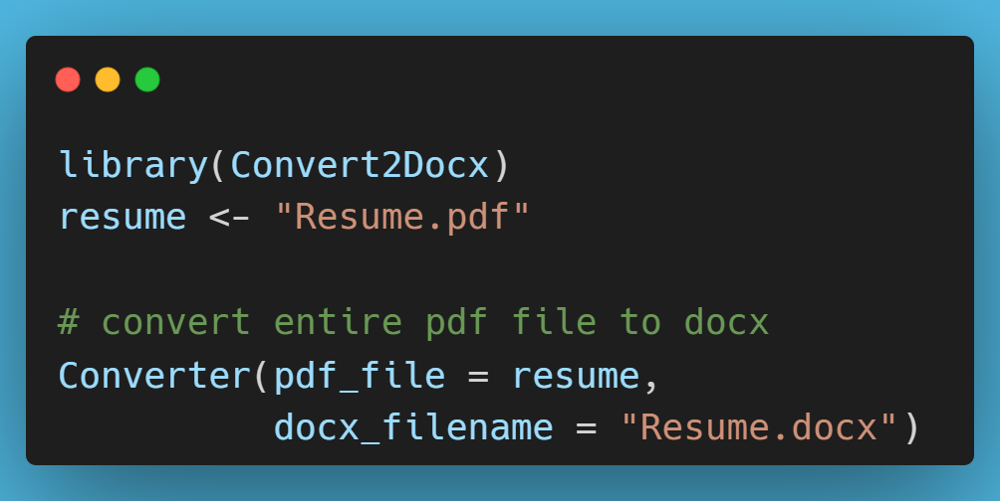
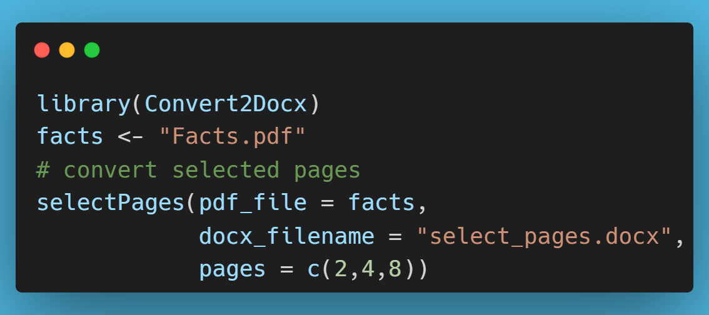

# Convert2Docx R Package 

The `{Convert2Docx}` package is essentially an R wrapper for the Python 'pdf2docx' module. It is easy to get started with the package.

First, you will need to install the package from github by running `devtools::install_github("Ifeanyi55/Convert2Docx")`. 

After that is done, in order to use the package functions, you will need to install the conversion engine, by running `install_engine()` once. If you encounter any installation issue, please run in your terminal `pip install pdf2docx` and then try again. That should fix any issue.

Please note that the converted `docx` file will be automatically downloaded to your working directory. 

Also, it is good to be aware that the pages of some pdf files are not correctly numbered. Therefore, when the conversion to docx is done, especially when converting selected pages, you might find that the page numbering is slightly different from what you are expecting. However, this "problem" does not occur when you convert the entire document to docx.

Let's now see some examples:

### Convert entire pdf file to docx

You would notice that you do not need to read in the pdf file in your script. The only thing you need to do is to just specify the path and pass that to the `Converter()` function.

### Convert from one page to another

Here, you can choose from which page you want the conversion to start and at which page you want it to end by using the `startANDend()` function

### Convert selected pages

You can select specific pages in the pdf file you wish to convert to a docx file by passing a numeric vector of the pages to the `pages` argument in the `selectPages()` function.

The package is light and easy to use, but if you encounter any problems, kindly raise an issue and I will endeavor to address it. Enjoy!

