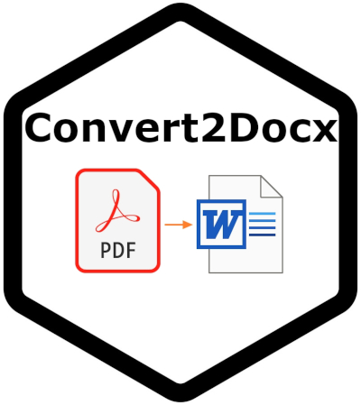

# Convert2Docx R Package

[](convert2docxB.jpg)

The `{Convert2Docx}` package provides an R interface to the Python `pdf2docx` module, simplifying the conversion of PDF files to DOCX format. It's designed to be easy to use, even for those unfamiliar with Python.

## Installation

1.  **Install the R package:**

    ```R
    devtools::install_github("Ifeanyi55/Convert2Docx")
    ```

2.  **Install the conversion engine (pdf2docx):**  This step is crucial for the package to function.  Run the following command *once*:

    ```R
    Convert2Docx::install_engine()
    ```

    *If you encounter installation issues*, try installing `pdf2docx` directly using `pip` in your terminal, then retry `install_engine()`:

    ```bash
    pip install pdf2docx
    ```

    This can resolve dependency problems.

## Usage

The converted `.docx` file will be automatically saved to your current working directory.

**Important Note:**  While the package strives for accuracy, some PDF files may have incorrectly numbered pages.  When converting *selected* pages, verify that the page numbers in the resulting DOCX file match your expectations. Converting the entire document usually avoids this issue.

Here are some examples of how to use the package:

### Convert an Entire PDF File to DOCX

You don't need to explicitly read the PDF file into your R script. Simply provide the file path to the `Converter()` function:

```R
Convert2Docx::Converter(pdf_path = "path/to/your/document.pdf")
```

### Convert a Range of Pages

Use the `startANDend()` function to specify the starting and ending pages for the conversion:

```R
Convert2Docx::startANDend(pdf_path = "path/to/your/document.pdf",
                         start_page = 3,
                         end_page = 7)
```

### Convert Specific Pages

Use the `selectPages()` function and provide a numeric vector of the pages you want to convert:

```R
Convert2Docx::selectPages(pdf_path = "path/to/your/document.pdf",
                         pages = c(1, 3, 5, 8))
```

## Troubleshooting and Support

This package aims to be user-friendly. If you encounter any issues or have suggestions for improvement, please open an issue on the [GitHub repository](https://github.com/Ifeanyi55/Convert2Docx).  We'll do our best to assist you.  Happy converting!
